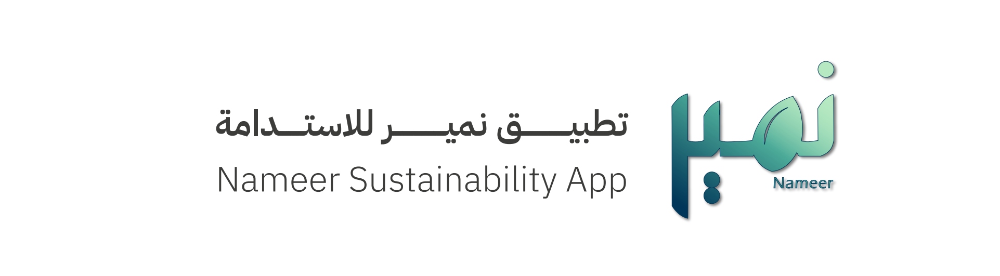

# 🌱 Nameer: A Gamified Sustainability Mobile App  
*(2025_GP_GroupNumber)*

  

---

## 📖 Introduction
**Nameer** (نمير) is inspired by the Arabic word for *pure water*, symbolizing life and sustainability.  
This mobile application motivates individuals to adopt **eco-friendly habits** such as:
- ♻️ Recycling  
- 🚶 Using public transport  

Our goal is to align with **Saudi Vision 2030** and the **Saudi Green Initiative (SGI)**, turning sustainability into a fun, engaging lifestyle.  

---

## 🚀 Features
✨ Gamified tasks with rewards  
✨ Eco-impact tracking dashboard  
✨ Recycling bin locator (Riyadh)  
✨ AI-powered validation (image recognition & auto-read tracking)  

---

## 🛠️ Technology Stack
- **Frontend**: Flutter (Dart)  
- **Backend / Database**:  
- **Machine Learning**: Python 
- **Tools**: GitHub, Google Colab  

---

## 📂 Project Structure
2025_GP_GroupNumber/
│
├── src/ # Flutter source code
├── docs/ # Documentation & diagrams
├── data/ # Dataset samples ( recycling bins, etc.)
│
├── AUTHORS # Team contributors
└── README.md # Project overview
